# Gorough


Based on [Rough.js](https://github.com/pshihn/rough).

Gorough works with [SVG](https://developer.mozilla.org/en-US/docs/Web/SVG).

## Install
```shell script
go get -u github.com/NovikovRoman/gorough
```
## Usage

### Create SVG canvas
```go
width := 500
height := 500
// w - io.Writer interface
canvas := svg.New(w)
canvas.Start(width, height)
// drawing code
canvas.End()
```

### Lines

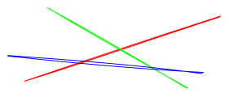

```go
line := gorough.NewLine(gorough.Point{X: 30, Y: 100}, gorough.Point{X: 270, Y: 20}, &gorough.LineOptions{
    Styles: &gorough.Styles{
        Stroke: "#ff0000",
    },
})

line2 := gorough.NewLine(gorough.Point{X: 60, Y: 10}, gorough.Point{X: 230, Y: 110}, &gorough.LineOptions{
    Styles: &gorough.Styles{
        Stroke: "#00ff00",
    },
})

line3 := gorough.NewLine(gorough.Point{X: 10, Y: 70}, gorough.Point{X: 250, Y: 90}, &gorough.LineOptions{
    Styles: &gorough.Styles{
        Stroke: "#0000ff",
    },
})

gorough.DrawSVG(canvas, line, nil)
gorough.DrawSVG(canvas, line2, nil)
gorough.DrawSVG(canvas, line3, nil)
```

### Rectangles

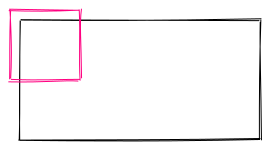

```go
rectangle := gorough.NewRectangle(gorough.Point{X: 20, Y: 20}, 240, 120, nil)

square := gorough.NewRectangle(gorough.Point{X: 10, Y: 10}, 70, 70, &gorough.RectangleOptions{
    Styles: &gorough.Styles{
        Stroke: "#ff0080",
    },
})

gorough.DrawSVG(canvas, rectangle, nil)
gorough.DrawSVG(canvas, square, nil)
```

### Poligons
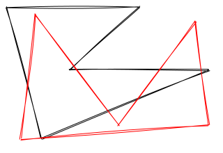

```go
poligon := gorough.NewPoligon([]gorough.Point{
    {X: 10, Y: 10},
    {X: 200, Y: 10},
    {X: 100, Y: 100},
    {X: 300, Y: 100},
    {X: 60, Y: 200},
}, nil)

poligon2 := gorough.NewPoligon([]gorough.Point{
    {X: 50, Y: 20},
    {X: 30, Y: 200},
    {X: 300, Y: 180},
    {X: 280, Y: 30},
    {X: 170, Y: 180},
}, &gorough.LineOptions{
    Styles: &gorough.Styles{
        Stroke: "#ff0000",
    },
})

gorough.DrawSVG(canvas, poligon, nil)
gorough.DrawSVG(canvas, poligon2, nil)
```

### Ellipses

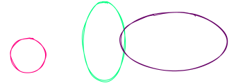

```go
circle := gorough.NewCircle(gorough.Point{X: 40, Y: 80}, 50, &gorough.EllipseOptions{
    Styles: &gorough.Styles{
        Stroke:      "#ff0080",
        StrokeWidth: 1,
    },
})

ellipseVert := gorough.NewEllipse(gorough.Point{X: 150, Y: 60}, 60, 110, &gorough.EllipseOptions{
    Styles: &gorough.Styles{
        Stroke:      "#00ff80",
    },
})

ellipseHoriz := gorough.NewEllipse(gorough.Point{X: 250, Y: 60}, 150, 80, &gorough.EllipseOptions{
    Styles: &gorough.Styles{
        Stroke:      "#660066",
        StrokeWidth: 1,
    },
})

gorough.DrawSVG(canvas, circle, nil)
gorough.DrawSVG(canvas, ellipseVert, nil)
gorough.DrawSVG(canvas, ellipseHoriz, nil)
```

### Arcs

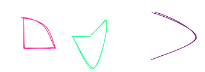
```go
arc := gorough.NewArc(gorough.Point{X: 40, Y: 80}, 100, 100, -math.Pi/2, 0, true,
		&gorough.EllipseOptions{
			Styles: &gorough.Styles{
				Stroke: "#ff0080",
			},
		})

arc2 := gorough.NewArc(gorough.Point{X: 150, Y: 60}, 60, 110, -math.Pi/6, math.Pi, true,
    &gorough.EllipseOptions{
        Styles: &gorough.Styles{
            Stroke: "#00ff80",
        },
    })

arc3 := gorough.NewArc(gorough.Point{X: 250, Y: 60}, 150, 80, -math.Pi/2, math.Pi/2, false,
    &gorough.EllipseOptions{
        Styles: &gorough.Styles{
            Stroke: "#660066",
        },
    })

gorough.DrawSVG(canvas, arc, nil)
gorough.DrawSVG(canvas, arc2, nil)
gorough.DrawSVG(canvas, arc3, nil)
```

### Linear Paths

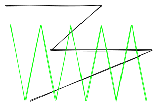

```go
linearPath := gorough.NewLinearPath([]gorough.Point{
    {X: 10, Y: 10},
    {X: 200, Y: 10},
    {X: 100, Y: 100},
    {X: 300, Y: 100},
    {X: 60, Y: 200},
}, nil)

linearPath2 := gorough.NewLinearPath([]gorough.Point{
    {X: 20, Y: 50},
    {X: 50, Y: 200},
    {X: 80, Y: 50},
    {X: 110, Y: 200},
    {X: 140, Y: 50},
    {X: 170, Y: 200},
    {X: 200, Y: 50},
    {X: 230, Y: 200},
    {X: 260, Y: 50},
    {X: 290, Y: 200},
}, &gorough.LineOptions{
    Styles: &gorough.Styles{
        Stroke: "#00ff00",
    },
})

gorough.DrawSVG(canvas, linearPath, nil)
gorough.DrawSVG(canvas, linearPath2, nil)
```
### Curves

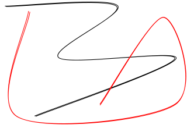

```go
curve := gorough.NewCurve([]gorough.Point{
    {X: 10, Y: 10},
    {X: 200, Y: 10},
    {X: 100, Y: 100},
    {X: 300, Y: 100},
    {X: 60, Y: 200},
}, nil)

curve2 := gorough.NewCurve([]gorough.Point{
    {X: 50, Y: 20},
    {X: 30, Y: 200},
    {X: 300, Y: 180},
    {X: 280, Y: 30},
    {X: 170, Y: 180},
}, &gorough.EllipseOptions{
    Styles: &gorough.Styles{
        Stroke: "#ff0000",
    },
})

gorough.DrawSVG(canvas, curve, nil)
gorough.DrawSVG(canvas, curve2, nil)
```

### Paths

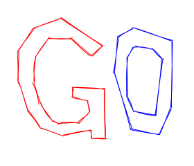

```go
svgPath, _ := gorough.NewPath("M4.5000 150.1500L4.5000 … 150.1500Z", &gorough.PathOptions{
    Styles: &gorough.Styles{
        Stroke: "#ff0000",
    },
})


svgPath2, _ := gorough.NewPath("M0.6000 184.5000L0.6000 … 184.5000Z", &gorough.PathOptions{
    Styles: &gorough.Styles{
        Stroke: "#0000ff",
    },
})

gorough.DrawSVG(canvas, svgPath, nil)
gorough.DrawSVG(canvas, svgPath2, nil)
```

### Filling

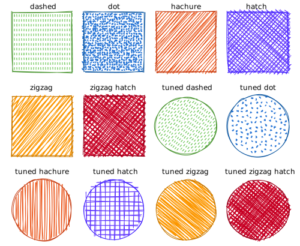

```go
// Fillers
dashedFiller := gorough.NewDashedFiller()
dotFiller := gorough.NewDotFiller()
hachureFiller := gorough.NewHachureFiller()
hatchFiller := gorough.NewHatchFiller()
zigZagFiller := gorough.NewZigZagFiller()
zigZagHatchFiller := gorough.NewZigZagHatchFiller()

hatch := gorough.NewRectangle(gorough.Point{X: 20, Y: 20}, 60, 60, &gorough.RectangleOptions{
    Styles: &gorough.Styles{
        Stroke:     "#4e9835",
        Fill:       "#60c247",
        FillWeight: 1,
        Filler:     hatchFiller,
    },
})

hatchFiller.SetAngle(90)
hatchFiller.SetGap(8)
hatchAlt := gorough.NewRectangle(gorough.Point{X: 100, Y: 20}, 60, 60, &gorough.RectangleOptions{
    Styles: &gorough.Styles{
        Stroke:     "#4e9835",
        Fill:       "#60c247",
        FillWeight: 1,
        Filler:     hatchFiller,
    },
})
```
## Options

### Styles

`Stroke` - String value representing the color of the drawn objects. Default value is black (#000000). If the this is set to none, the shape vectors do not contain a stroke (This is different from having a transparent stroke).

`StrokeWidth` - Numerical value to set the width of the strokes (in pixels). Default value is 1.

`Fill` - String value representing the color used to fill a shape. In hachure style fills, this represents the color of the hachure lines. In dots style, it represents the color of the dots.

`FillWeight` - Numeric value representing the width of the hachure lines. Default value of the fillWeight is set to half the strokeWidth of that shape.

`Filler` - fill styles (dashedFiller, dotFiller, hachureFiller, hatchFiller, zigZagFiller, zigZagHatchFiller).
If filler value is nil and fill is not empty then fill style solid.

### PenOptions

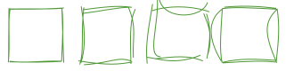

The image shows:

1. Default options
2. MaxRandomnessOffset - 15
3. Roughness - 6
4. Bowing - 30

`MaxRandomnessOffset` - Default value is 2.

`Roughness` - Numerical value indicating how rough the drawing is. A rectangle with the roughness of 0 would be a perfect rectangle. Default value is 1. There is no upper limit to this value, but a value over 10 is mostly useless.

`Bowing` - Numerical value indicating how curvy the lines are when drawing a sketch. A value of 0 will cause straight lines. Default value is 1.

### CurveOptions

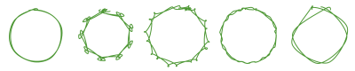

The image shows:

1. Default options
2. Tightness - 3
3. Tightness - -3
4. StepCount - 50
5. StepCount - 4

`Tightness` - Concavity of arcs between points. Default value is 0.

`Fitting` - When drawing ellipses, circles, and arcs, Let RoughJS know how close should the rendered dimensions be when compared to the specified one. Default value is 0.95 - which means the rendered dimensions will be at least 95% close to the specified dimensions. A value of 1 will ensure that the dimensions are almost 100% accurate.

`StepCount` - When drawing ellipses, circles, and arcs, RoughJS approximates curveStepCount number of points to estimate the shape. Default value is 9.

### Attributes

Set attributes for an SVG shape group.

```go
attrs := gorough.Attributes{
    {"id", "myShape"},
}

gorough.DrawSVG(canvas, shape, attrs)

attrs["id"] = "otherShape"
attrs["data-value"] = "123"
gorough.DrawSVG(canvas, shape, attrs)
```
In SVG:
```svg
<g id="myShape">
<path d="M42.8755552948236 … 55.54974206571005" fill='none' stroke='#ff0080' stroke-width='1' fill-weight='0' />
</g>
<g id="otherShape" data-value="123">
<path d="M42.8755552948236 … 55.54974206571005" fill='none' stroke='#ff0080' stroke-width='1' fill-weight='0' />
</g>
```

## Start example

```shell script
cd examples/ && go build -o "example" && ./example
```

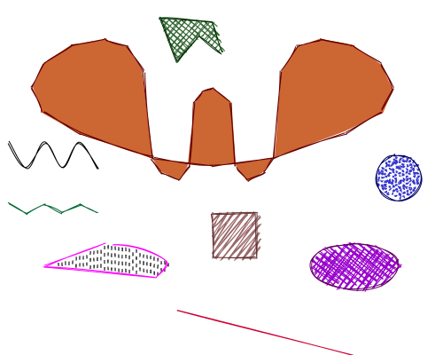


## License
[MIT License](LICENSE) © Roman Novikov